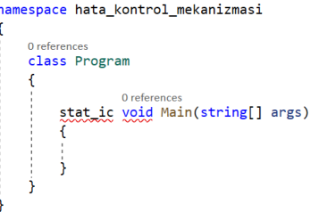
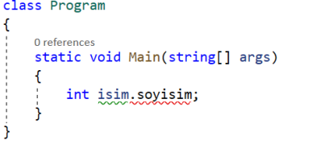
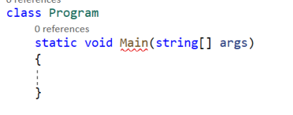

# Hata Kontrol Mekanizmaları
#### 3 tür hata çeşidi vardır. Bunlardan birincisi compiler (derleme) hataları, ikincisi run-time (çalışma zamanı) hataları, üçüncüsü ise logical (mantıksal) hatalardır.

* <a href="#compiler">Compiler Hataları</a>
* <a href="#runtime">Run-Time Hataları</a>
* <a href="#logical">Logical Hatalar</a> 
<br><br>

<h2 id="compiler">I. Compiler Hataları</h2>
<p>- Programlama dili kurallarına aykırı olan syntax hatalarıdır.</p>
<p>- Özellikle gelişmiş editörler (VS) sayesinde söz dizimi hataları derlemeye gerek bile kalmaksızın fark edilebilmektedir.</p>
<p>- Hatanın bulunduğu satır derleyici tarafından rapor edilir. Gelişmiş editörlerde ise hataya nokta atışı yapılarak hatanın nerde olduğunu bize direkt söyler.</p>
<p>Örneğin;</p>



<br><br>

<h2 id="runtime">II. Run-Time Hataları</h2>
<p>- Syntax'da bir promlem yok, kodun semantiği kusursuz ama çalışma zamanında patlamaya sebep veren hatalardır.</p>
<p>- Yazılım ayaktayken ortaya çıkan bir takım aykırı durumlardan dolayı programın işletim sistemi tarafından kesilmesiyle/sonlandırılmasıyla sonuçlanır.</p>
<p>- Çalışma zamanı hataları programın işleyişinin ortasında direkt kullanıcıyla temas edebilecek hatalardır. Ve hiçbir yazılımcı son kullanıcının hatayla 
karşılaşmasını istemez.</p>
<p>- Bu yüzden çalışma zamanında alınabilecek "olası" hataları yönetmemiz ve onları bir şekilde manipüle etmemiz gerekmektedir.</p>
<p>- Çalışma zamanı hataları genellikle kullanılan mimaride öntanımlı mesajları verecektir.</p>
<p>- Hata kontrol mekanizmaları çalışma zamanı hatalarını kullanıcıya hissettirmeden yakalayabilmek ve ilgili hatayı manipüle edebilmek için vardır.</p>

* ### run-time hatalarını kontrol etmek için try-catch mekanizması:  
<p>Run-time'da alınan hataları manipüle etmemizi / karşılamamızı / kontrol etmemizi sağlayan programatik bir yapıdır.</p>
<p>Try-catch yapılanması, uygulama sürecinde yaşanan hatayı kullanıcıya hissettirmeksizin farklı bir durum ya da olağan bir mesaj gibi göstermemizi sağlayan 
ve bunun yanında patlamaya / hataya dair bizlere bilgi sunan ve bu bilgiler eşliğinde kayıt dosyaları / kayıtlar oluşturmamızı sağlayan bir mekanizmadır. 
</p>
<p> Amaç;</p>
<p> * Alınan hatayı, kullanıcıya hissettirmemek</p>
<p> * Alınan hatanın nedenine dair kullanıcıyı bilgilendirmek</p>
<p> * İşletim sistemleri aykırı durum yaşandığında uygulamayı sonlandırmak isterler ve sonlandırırlar. Try-catch yapılanması ile alınan hataya dair
manipülasyon gerçekleştirilir ve uygulamanın kapanmadan devam etmesi sağlanır.  
</p>
<p>Prototip:</p>

```c#
try
{
    //olası çalışma zamanı hatalarını barındıran / hata verebilecek kodları buraya yazıyoruz. 
}
catch
{
    //try içerisinde olası hata söz konusu olursa kodun akışı orada kesilecek ve akış, bu bloktan devam edecektir. 
}
```
<p>Try-catch yapılanması, bir hatanın fırlatılabileceği kodları durmadan kontrol eden maliyetli bir yapıdır. Dolayısıyla try içerisindeki kodlar, 
lüzumsuz kodlar olmamalıdır.</p>
<p>Sadece hata verebilecek kodları barındıran bir yaklaşım sergilememiz kontrol maliyeti açısından daha verimli ve  performanslı olacaktır.</p>


